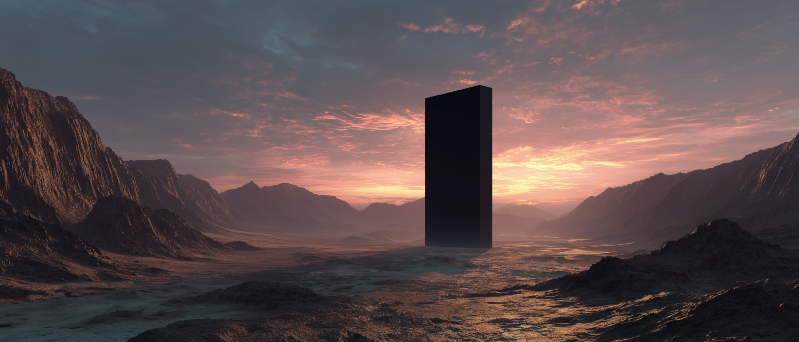
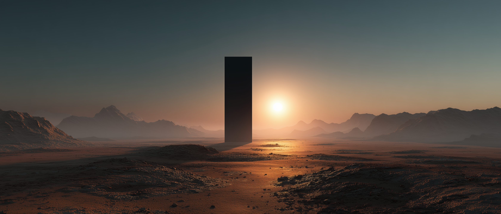
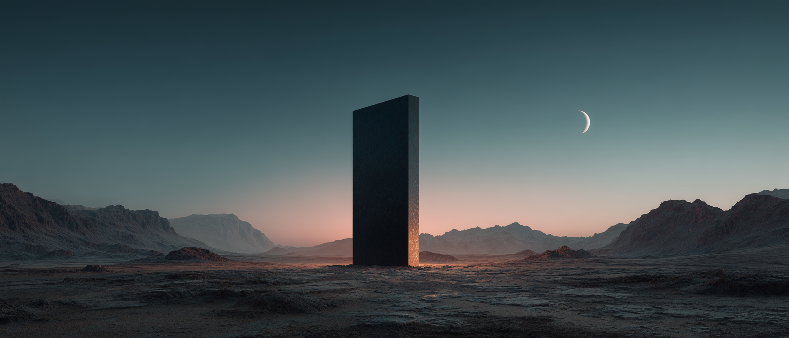

# Omarchy Monolith Theme

Monolith is a gapless Rosé Pine Moon desktop built around square geometry, dark translucent surfaces, and an iris-to-pine edge. It keeps the workspace dense and quiet with zero gaps, softened background blur, 50% terminal transparency, and a landscape set centered on the black monolith.

Built for Omarchy 4.0, with legacy theme files retained for earlier Omarchy setups.

## Preview


## Install

Install directly with Omarchy:

```bash
omarchy theme install https://github.com/OldJobobo/omarchy-monolith-theme
```

The theme uses **Zafiro Icons Dark**. Install it from the [Zafiro Icons project](https://github.com/zayronxio/Zafiro-icons) or your preferred Arch/AUR package before applying Monolith.

## What's Included

- A complete Omarchy 4 semantic palette and coordinated shell surfaces based on Rosé Pine Moon.
- Gapless Hyprland styling with square corners, a 3 px iris-to-pine border, and a tuned low-noise blur treatment.
- Matching 50% translucent themes for Foot, Alacritty, Kitty, and Ghostty.
- Native color coverage for the Omarchy shell, VS Code, Helix, Neovim/Aether v3, btop, Pi, Obsidian, Chromium, and other generated surfaces.
- Legacy Waybar, Walker, Wofi, Mako, SwayOSD, Hyprlock, and Hyprland configuration for older setups.
- Five high-resolution wallpapers designed to remain composed on landscape and portrait displays.

## Overlays

<table>
  <tr>
    <td align="center"><br><sub>SwayOSD</sub></td>
    <td align="center"><br><sub>Walker launcher</sub></td>
  </tr>
</table>

## Wallpapers

<table>
  <tr>
    <td align="center"><br><sub>Pastel Basin</sub></td>
    <td align="center"><br><sub>Frozen Ring Dawn</sub></td>
    <td align="center"><br><sub>Crimson Dawn</sub></td>
  </tr>
  <tr>
    <td align="center"><br><sub>Desert Sunrise</sub></td>
    <td align="center"><br><sub>Moonrise</sub></td>
  </tr>
</table>

## Notes

- Terminal opacity is intentionally set to `0.5`; open a new terminal window after changing themes if an existing process keeps its previous opacity.
- The Hyprland blur profile darkens and softens the visible wallpaper behind translucent windows to preserve text contrast.
- Wallpapers under `backgrounds-retired/` are archived alternatives and are not included in Omarchy's active wallpaper rotation.

## Attribution

- Color foundation: [Rosé Pine Moon](https://rosepinetheme.com/palette/)
- Icon theme: [Zafiro Icons](https://github.com/zayronxio/Zafiro-icons) by Zayronxio
